  # Hi there, I'm Frances Julia Miranda 👋

  ### 🛠️ Tech Stack & Tools

  

    <!-- Languages -->
    
    
    
    
    
    
     
    <!-- Database & Tools -->
    
    
    
    
  

  ---

  ### 🕷️ Activities

  

    
  

  ---

  ###  Connect With Me!

  

    Feel free to reach out for collaborations, discussions, or just to say hi!
  

  

    
    &nbsp;&nbsp;
    
  

